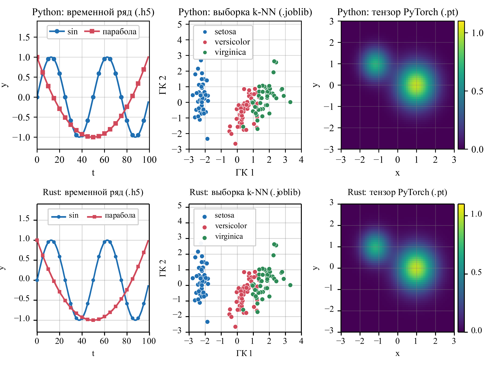

# pyferrite-check

End-to-end validation of the Rust crate
[pyferrite](https://crates.io/crates/pyferrite)
([source](https://github.com/89605502155/pyferrite)): Python writes typical
data structures to every supported file format, Rust reads them back with
pyferrite from crates.io, checks them against a manifest and redraws the same
plots.



*Top row: drawn by matplotlib in `validation.ipynb` from the data it
generated. Bottom row: drawn by [plotters](https://crates.io/crates/plotters)
in Rust from the files that pyferrite read: a time series from `.h5`, the
k-NN training set from `.joblib`, a 2-D field from a PyTorch `.pt` tensor.*

## Result

pyferrite 0.0.2 reads all 46 files and passes all 301 checks:

| Format    | Files | Checks passed |
|-----------|------:|--------------:|
| `.npy`    | 9     | 9             |
| `.npz`    | 6     | 32            |
| `.pkl`    | 10    | 102           |
| `.joblib` | 9     | 71            |
| `.pt`     | 7     | 62            |
| `.h5`     | 5     | 25            |
| **Total** | **46**| **301**       |

The full per-file report is in `figures/rust_report.json`.

## What is checked

`validation.ipynb` creates:

- a time series (`sin` and a parabola over `t = 0..99`) as a dict of arrays
  and as a pandas 3 `DataFrame`;
- a k-NN classifier fitted on Fisher's irises: its training arrays and class
  names, and the whole fitted `KNeighborsClassifier` object;
- a 2-D field as a PyTorch tensor and the `state_dict` of a small PyTorch
  network;
- the weights of a TensorFlow/Keras model as nested dicts;
- plain Python values: list, tuple, set, nested containers, unicode and byte
  strings, a 101-bit integer, `inf`, complex numbers, `None`;
- a zoo of numpy element types (bool, all integer widths, float16/32/64,
  complex64/128, unicode, a 0-d array), Fortran order and big-endian `.npy`;
- a poisoned pickle that would call `os.system` when unpickled in Python.

Each structure is saved in every format that can hold it, and
`data/manifest.json` records what a correct reader must find for every value:
its path, type, shape, sum, first and last element.

`rust/` reads every file with pyferrite and compares the result with the
manifest. Two special cases: the fitted sklearn estimator must be captured as an
inert object description with its arrays readable (no Python code runs), and
the poisoned pickle must be refused by the default read.

## Run it

Python part (writes `data/` and the top row of the figure):

```
pip install -r requirements.txt
python make_notebook.py --execute     # builds and runs validation.ipynb
```

Rust part (needs Rust 1.75+ and the Times New Roman font):

```
cd rust
cargo run --release
```

It prints one line per file and writes `figures/rust_panels.*`,
`figures/rust_report.json` and the combined figure
`figures/validation_figure.png` / `.tif` (600 dpi). The exit code is non-zero
if any check fails.

The data files are committed, so the Rust part can be run without Python.

## Defects this validation found

Running it against pyferrite 0.0.1 found three defects, fixed in 0.0.2
(see the [changelog](https://github.com/89605502155/pyferrite/blob/main/CHANGELOG.md)):

1. pandas 3 `DataFrame`: column labels stored as an Arrow string array were
   lost (`column_0`, `column_1`, ...).
2. A fitted sklearn `KNeighborsClassifier` (its `KDTree` holds a structured
   numpy array) could not be read from `.pkl` or `.joblib`.
3. numpy `bool` datasets written by h5py were read as `uint8`.

## Licence and authors

MIT, see [LICENSE](LICENSE).
Andrey O. Ferubko and Oleg D. Kazakov, Bryansk State Engineering
Technological University (BGITU), Bryansk, Russia.
